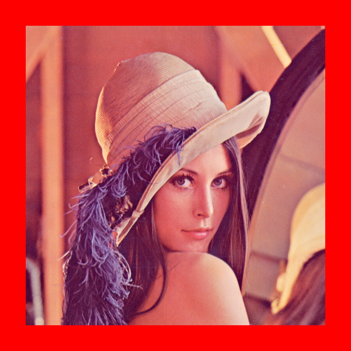

# sips

`sips` is a macOS cli tool for scriptable image processing without external dependencies.

## Contents

- [Overview](#overview)
- [Quick Start](#quick-start)
- [Source Image](#source-image)
- [Getting Image Properties](#getting-image-properties)
- [Format Conversion](#format-conversion)
- [Resizing and Resampling](#resizing-and-resampling)
- [Rotation and Flipping](#rotation-and-flipping)
- [Cropping and Padding](#cropping-and-padding)
- [Color Profile Management](#color-profile-management)
- [Metadata Operations](#metadata-operations)
- [Batch Processing](#batch-processing)
- [Advanced Features](#advanced-features)
- [Supported Formats](#supported-formats)
- [Tips and Best Practices](#tips-and-best-practices)

## Overview

SIPS (Scriptable Image Processing System) is a powerful command-line utility built into macOS since Mac OS X 10.3 (Panther). It enables image manipulation and processing operations directly from the terminal without requiring additional software like ImageMagick.

> [!NOTE]
> SIPS is exclusive to macOS and leverages Apple's Core Graphics frameworks for high-performance image processing.

- [Key Features](#key-features)
- [Common Use Cases](#common-use-cases)

### Key Features

- Pre-installed on all macOS systems
- Supports 40+ image formats (reading) and 20+ formats (writing)
- Batch processing capabilities
- Color profile management
- Metadata manipulation
- JavaScript integration for advanced operations
- No external dependencies

### Common Use Cases

- Batch resize images for web deployment
- Convert between image formats
- Add watermarks or copyright metadata
- Create thumbnails
- Optimize images for sharing
- Process RAW files from cameras
- Automate image workflows

## Quick Start

- [Basic Commands](#basic-commands)
- [Essential Operations](#essential-operations)

### Basic Commands

```bash
# Get image dimensions
sips -g pixelWidth -g pixelHeight image.png

# Convert format
sips -s format jpeg image.png --out image.jpg

# Resize image
sips -Z 800 image.jpg --out resized.jpg

# Rotate 90 degrees
sips -r 90 image.jpg --out rotated.jpg
```

### Essential Operations

```bash
# Batch convert PNG to JPEG
for file in *.png; do
    sips -s format jpeg "$file" --out "${file%.png}.jpg"
done

# Create thumbnails
sips -Z 150 *.jpg --out thumbnails/

# Add copyright metadata
sips -s copyright "© 2024 Your Name" image.jpg --out protected.jpg
```

## Source Image

All examples in this guide use the following test image:


*lena.png (462KB)*

## Getting Image Properties

Query various properties of images including dimensions, DPI, format, and metadata.

- [Get Image Dimensions](#get-image-dimensions)
- [Get All Properties](#get-all-properties)
- [Get Specific Properties](#get-specific-properties)

### Get Image Dimensions

```bash
sips -g pixelWidth -g pixelHeight assets/input/lena.png
```

#### Generated Output

```
/Users/james/code/tinker/sips/assets/input/lena.png
  pixelWidth: 512
  pixelHeight: 512
```

### Get All Properties

```bash
sips -g all assets/input/lena.png
```

#### Generated Output

```
/Users/james/code/tinker/sips/assets/input/lena.png
  pixelWidth: 512
  pixelHeight: 512
  typeIdentifier: public.png
  format: png
  formatOptions: default
  dpiWidth: 72.000
  dpiHeight: 72.000
  samplesPerPixel: 3
  bitsPerSample: 8
  hasAlpha: no
  space: RGB
  profile: sRGB IEC61966-2.1
```

### Get Specific Properties

```bash
# Get DPI information
sips -g dpiHeight -g dpiWidth assets/input/lena.png

# Get format information
sips -g format -g typeIdentifier assets/input/lena.png

# Get color information
sips -g space -g hasAlpha -g profile assets/input/lena.png
```

## Format Conversion

Convert images between different formats with optional quality settings.

- [Basic Format Conversion](#basic-format-conversion)
- [JPEG Quality Settings](#jpeg-quality-settings)
- [Convert to Other Formats](#convert-to-other-formats)
- [Batch Format Conversion](#batch-format-conversion)

### Basic Format Conversion

```bash
# Convert PNG to JPEG
sips -s format jpeg assets/input/lena.png --out assets/output/lena_converted.jpg
```

#### Generated Image


*lena_converted.jpg (76KB)*

### JPEG Quality Settings

```bash
# Convert with 50% quality
sips -s format jpeg -s formatOptions 50 assets/input/lena.png --out assets/output/lena_jpeg_50.jpg
```

#### Generated Image


*lena_jpeg_50.jpg (37KB)*

```bash
# Quality options: low, normal, high, best, or percentage (0-100)
sips -s format jpeg -s formatOptions high image.png --out high_quality.jpg
sips -s format jpeg -s formatOptions best image.png --out best_quality.jpg
sips -s format jpeg -s formatOptions 85 image.png --out custom_quality.jpg
```

### Convert to Other Formats

```bash
# Convert to TIFF
sips -s format tiff assets/input/lena.png --out assets/output/lena_converted.tiff
```

#### Generated Image

*lena_converted.tiff (771KB)*

> [!NOTE]
> TIFF files are not displayed in markdown but the conversion creates a high-quality uncompressed image.

```bash
# Other format conversions
sips -s format bmp image.png --out image.bmp
sips -s format gif image.png --out image.gif
sips -s format heic image.jpg --out image.heic
sips -s format pdf image.png --out document.pdf
```

### Batch Format Conversion

```bash
# Convert all PNGs in current directory to JPEG
for file in *.png; do
    sips -s format jpeg "$file" --out "${file%.png}.jpg"
done

# Convert with specific quality and to new directory
mkdir jpeg_versions
for file in *.png; do
    sips -s format jpeg -s formatOptions 90 "$file" --out "jpeg_versions/${file%.png}.jpg"
done
```

## Resizing and Resampling

Resize images using different methods to maintain or change aspect ratios.

- [Resize to Exact Dimensions](#resize-to-exact-dimensions)
- [Resize Maximum Dimension](#resize-maximum-dimension)
- [Resample by Width or Height](#resample-by-width-or-height)
- [Batch Resize Operations](#batch-resize-operations)

### Resize to Exact Dimensions

```bash
# Resize to exact 256x256 (may distort if aspect ratio doesn't match)
sips -z 256 256 assets/input/lena.png --out assets/output/lena_256x256.png
```

#### Generated Image


*lena_256x256.png (123KB)*

### Resize Maximum Dimension

```bash
# Resize so the largest dimension is 300px (maintains aspect ratio)
sips -Z 300 assets/input/lena.png --out assets/output/lena_max300.png
```

#### Generated Image


*lena_max300.png (168KB)*

### Resample by Width or Height

```bash
# Resample to 200px width (height adjusts proportionally)
sips --resampleWidth 200 assets/input/lena.png --out assets/output/lena_width200.png
```

#### Generated Image


*lena_width200.png (75KB)*

```bash
# Resample to 300px height (width adjusts proportionally)
sips --resampleHeight 300 assets/input/lena.png --out assets/output/lena_height300.png
```

#### Generated Image


*lena_height300.png (168KB)*

### Batch Resize Operations

```bash
# Create multiple size versions
for size in 150 300 600 1200; do
    sips -Z $size original.jpg --out "image_${size}px.jpg"
done

# Resize all images maintaining aspect ratio
mkdir resized
for file in *.jpg; do
    sips -Z 1024 "$file" --out "resized/$file"
done
```

## Rotation and Flipping

Transform images through rotation and flipping operations.

- [Rotate Images](#rotate-images)
- [Flip Images](#flip-images)
- [Combined Transformations](#combined-transformations)

### Rotate Images

```bash
# Rotate 90 degrees clockwise
sips -r 90 assets/input/lena.png --out assets/output/lena_rotate90.png
```

#### Generated Image


*lena_rotate90.png (506KB)*

```bash
# Rotate 45 degrees
sips -r 45 assets/input/lena.png --out assets/output/lena_rotate45.png
```

#### Generated Image


*lena_rotate45.png (526KB)*

```bash
# Other rotation angles
sips -r 180 image.jpg --out rotated_180.jpg
sips -r -30 image.jpg --out rotated_neg30.jpg  # Counter-clockwise
```

### Flip Images

```bash
# Flip horizontally (mirror)
sips -f horizontal assets/input/lena.png --out assets/output/lena_flip_horizontal.png
```

#### Generated Image


*lena_flip_horizontal.png (508KB)*

```bash
# Flip vertically
sips -f vertical assets/input/lena.png --out assets/output/lena_flip_vertical.png
```

#### Generated Image


*lena_flip_vertical.png (508KB)*

### Combined Transformations

```bash
# Rotate and resize in one command
sips -r 45 -Z 300 image.jpg --out transformed.jpg

# Flip and convert format
sips -f horizontal -s format png image.jpg --out flipped.png

# Multiple operations
sips -r 90 -f horizontal -Z 500 -s format jpeg image.png --out final.jpg
```

## Cropping and Padding

Crop images to specific dimensions or add padding around them.

- [Crop Images](#crop-images)
- [Crop with Offset](#crop-with-offset)
- [Pad Images](#pad-images)
- [Pad with Colors](#pad-with-colors)

### Crop Images

```bash
# Crop to 300x300 from center
sips -c 300 300 assets/input/lena.png --out assets/output/lena_crop300x300.png
```

#### Generated Image


*lena_crop300x300.png (187KB)*

> [!NOTE]
> SIPS crops equal amounts from opposite sides when no offset is specified, centering the crop area.

### Crop with Offset

```bash
# Crop with offset (50px from top, 50px from left)
sips -c 200 300 --cropOffset 50 50 assets/input/lena.png --out assets/output/lena_crop_offset.png
```

#### Generated Image


*lena_crop_offset.png (122KB)*

### Pad Images

```bash
# Pad to 600x600 with default color (black)
sips -p 600 600 assets/input/lena.png --out assets/output/lena_pad600x600.png
```

#### Generated Image


*lena_pad600x600.png (523KB)*

### Pad with Colors

```bash
# Pad with red background
sips -p 600 600 --padColor FF0000 assets/input/lena.png --out assets/output/lena_pad_red.png
```

#### Generated Image



*lena_pad_red.png (523KB)*

```bash
# Other padding colors
sips -p 600 600 --padColor 0000FF image.png --out blue_pad.png    # Blue
sips -p 600 600 --padColor FFFFFF image.png --out white_pad.png   # White
sips -p 600 600 --padColor 808080 image.png --out gray_pad.png    # Gray
```

## Color Profile Management

Manage color profiles and color spaces for accurate color reproduction.

- [Query Color Profiles](#query-color-profiles)
- [Profile Operations](#profile-operations)
- [Color Management](#color-management)

### Query Color Profiles

```bash
# Get color profile name
sips -g profile assets/input/lena.png

# Get comprehensive color information
sips -g space -g profile -g hasAlpha assets/input/lena.png
```

#### Generated Output

```
/Users/james/code/tinker/sips/assets/input/lena.png
  space: RGB
  profile: sRGB IEC61966-2.1
  hasAlpha: no
```

### Profile Operations

```bash
# Extract embedded profile to file
sips -x profile output.icc image.jpg

# Embed a profile into an image
sips -e assets/profiles/sRGB_IEC61966-2.1.icc image.jpg --out image_profiled.jpg

# Embed profile only if none exists
sips -E assets/profiles/sRGB_IEC61966-2.1.icc image.jpg --out image_srgb.jpg

# Match to specific profile
sips -m /System/Library/ColorSync/Profiles/Generic RGB Profile.icc image.png --out matched.png
```

### Color Management

```bash
# Remove color management properties
sips --deleteColorManagementProperties assets/input/lena.png --out assets/output/lena_no_color_mgmt.png
```

#### Generated Image


*lena_no_color_mgmt.png (513KB)*

```bash
# Match with different rendering intents
# Options: perceptual, relative, saturation, absolute
sips -M /System/Library/ColorSync/Profiles/sRGB Profile.icc perceptual image.jpg --out matched.jpg
```

## Metadata Operations

Read and write image metadata including EXIF data, copyright, and descriptions.

- [Read Metadata](#read-metadata)
- [Write Metadata](#write-metadata)
- [Manage Metadata](#manage-metadata)

### Read Metadata

```bash
# Get all metadata as XML
sips -g allxml image.jpg

# Get specific metadata fields
sips -g make -g model -g software image.jpg
sips -g creation -g copyright -g artist image.jpg
```

### Write Metadata

```bash
# Set copyright, artist, and description
sips -s copyright "© 2024 Example" -s artist "John Doe" -s description "Test image" assets/input/lena.png --out assets/output/lena_metadata.png
```

#### Generated Image


*lena_metadata.png (513KB)*

```bash
# Verify metadata was set
sips -g copyright -g artist -g description assets/output/lena_metadata.png
```

#### Generated Output

```
/Users/james/code/tinker/sips/assets/output/lena_metadata.png
  copyright: © 2024 Example
  artist: John Doe
  description: Test image
```

### Manage Metadata

```bash
# Delete specific metadata properties
sips -d copyright -d artist image.jpg --out clean_image.jpg

# Change DPI settings
sips -s dpiHeight 300 -s dpiWidth 300 image.jpg --out highres.jpg

# Set multiple properties at once
sips -s copyright "© 2024" \
     -s artist "Your Name" \
     -s description "Professional photo" \
     -s software "SIPS" \
     image.jpg --out tagged.jpg
```

## Batch Processing

Process multiple images efficiently using shell scripting and sips.

- [Basic Batch Operations](#basic-batch-operations)
- [Advanced Batch Processing](#advanced-batch-processing)
- [Error Handling](#error-handling)
- [Useful Functions](#useful-functions)

### Basic Batch Operations

```bash
# Convert all PNG files to JPEG
for file in *.png; do
    sips -s format jpeg "$file" --out "${file%.png}.jpg"
done

# Resize all images in directory
for file in *.jpg; do
    sips -Z 800 "$file" --out "resized_$file"
done

# Process to new directory with multiple operations
mkdir processed
for file in *.png; do
    sips -s format jpeg -Z 1024 -s formatOptions 85 "$file" --out "processed/$file"
done
```

### Advanced Batch Processing

```bash
# Create multiple versions of each image
for file in *.jpg; do
    base="${file%.jpg}"
    # Thumbnail
    sips -Z 150 "$file" --out "thumbs/${base}_thumb.jpg"
    # Web version
    sips -Z 800 -s format jpeg -s formatOptions 85 "$file" --out "web/${base}_web.jpg"
    # Print version
    sips -s dpiHeight 300 -s dpiWidth 300 "$file" --out "print/${base}_print.jpg"
done

# Process only large images
for file in *.jpg; do
    width=$(sips -g pixelWidth "$file" | awk '/pixelWidth:/{print $2}')
    if [ "$width" -gt 2000 ]; then
        sips -Z 1920 "$file" --out "resized/$file"
    fi
done
```

### Error Handling

```bash
#!/bin/bash
# Safe batch processing with error handling

process_images() {
    local source_dir="${1:-.}"
    local output_dir="${2:-processed}"

    # Create output directories
    mkdir -p "$output_dir"/{thumbnails,web,original}

    # Process each image
    for file in "$source_dir"/*.{jpg,jpeg,png,gif}; do
        [ ! -f "$file" ] && continue

        echo "Processing: $(basename "$file")"
        base=$(basename "$file" | sed 's/\.[^.]*$//')

        # Create thumbnail
        if sips -Z 150 "$file" --out "$output_dir/thumbnails/${base}_thumb.jpg" 2>/dev/null; then
            echo "  ✓ Thumbnail created"
        else
            echo "  ✗ Thumbnail failed"
        fi

        # Create web version
        if sips -Z 1200 -s format jpeg -s formatOptions 80 "$file" --out "$output_dir/web/${base}_web.jpg" 2>/dev/null; then
            echo "  ✓ Web version created"
        else
            echo "  ✗ Web version failed"
        fi
    done
}

# Usage
process_images "/path/to/images" "/path/to/output"
```

### Useful Functions

```bash
# Function to optimize images for web
optimize_for_web() {
    local max_width="${1:-1200}"
    local quality="${2:-85}"
    local input_dir="${3:-.}"

    mkdir -p web_optimized

    find "$input_dir" -type f \( -iname "*.jpg" -o -iname "*.jpeg" -o -iname "*.png" \) | while read -r file; do
        basename=$(basename "$file")
        name="${basename%.*}"
        sips -Z "$max_width" -s format jpeg -s formatOptions "$quality" "$file" \
             --out "web_optimized/${name}_web.jpg"
    done
}

# Function to create a contact sheet
create_contact_sheet() {
    local tile_size="${1:-200}"

    mkdir -p contact_sheet
    counter=0

    for file in *.jpg; do
        [ ! -f "$file" ] && continue
        sips -Z "$tile_size" -c "$tile_size" "$tile_size" "$file" \
             --out "contact_sheet/$(printf "%04d" $counter).jpg"
        ((counter++))
    done

    echo "Created $counter tiles in contact_sheet/"
}

# Function to add watermark text (via metadata)
add_copyright_watermark() {
    local copyright_text="$1"
    local input_pattern="${2:-*.jpg}"

    mkdir -p watermarked

    for file in $input_pattern; do
        [ ! -f "$file" ] && continue
        sips -s copyright "$copyright_text" "$file" --out "watermarked/$file"
    done
}
```

## Advanced Features

Additional powerful features for specialized image processing tasks.

- [Icon Generation](#icon-generation)
- [Optimization](#optimization)
- [JavaScript Integration](#javascript-integration)
- [Complex Operations](#complex-operations)
- [RAW File Processing](#raw-file-processing)

### Icon Generation

```bash
# Add icon representation to image file (macOS specific)
sips -i assets/input/lena.png
```

> [!NOTE]
> This embeds a thumbnail icon into the file that appears in Finder. The file itself acts as its own icon.

### Optimization

```bash
# Optimize image colors for sharing across different devices
sips --optimizeColorForSharing assets/input/lena.png --out assets/output/lena_optimized.png
```

#### Generated Image


*lena_optimized.png (512KB)*

### JavaScript Integration

SIPS supports JavaScript execution for advanced image manipulation:

```bash
# Execute JavaScript file on image
sips -j script.js image.png --out modified.png
```

Example JavaScript for sips:

```javascript
// Create a canvas
var canvas = new Canvas(512, 512);
var ctx = canvas.getContext("2d");

// Load the input image
var img = new Image();
img.src = sips.images[0];

// Draw the image
ctx.drawImage(img, 0, 0);

// Add a red rectangle overlay
ctx.fillStyle = "rgba(255, 0, 0, 0.3)";
ctx.fillRect(50, 50, 200, 200);

// Add text
ctx.fillStyle = "white";
ctx.font = "bold 30px Arial";
ctx.fillText("WATERMARK", 100, 250);

// Output the modified canvas
canvas
```

### Complex Operations

```bash
# Chain multiple operations
sips -Z 800 \
     -r 15 \
     -s format jpeg \
     -s formatOptions 90 \
     -s copyright "© 2024" \
     -s description "Processed image" \
     image.png \
     --out final.jpg

# Create artistic effects by combining operations
sips -Z 500 -r 45 -p 600 600 --padColor 000000 image.jpg --out artistic.jpg
```

### RAW File Processing

```bash
# Convert RAW to JPEG (supports CR2, NEF, ARW, RAF, etc.)
sips -s format jpeg camera_raw.cr2 --out processed.jpg

# Extract preview with size limit
sips -s format jpeg -Z 2000 raw_file.dng --out preview.jpg

# Batch process RAW files
for raw in *.CR2; do
    sips -s format jpeg -Z 1920 -s formatOptions 90 "$raw" \
         --out "jpeg/${raw%.CR2}.jpg"
done
```

## Supported Formats

SIPS supports a wide variety of image formats for reading and writing.

- [Readable Formats](#readable-formats)
- [Writable Formats](#writable-formats)
- [Format-Specific Notes](#format-specific-notes)

### Readable Formats

**Common Formats:**
- JPEG (.jpg, .jpeg)
- PNG (.png)
- GIF (.gif)
- TIFF (.tif, .tiff)
- PDF (.pdf)
- BMP (.bmp)
- HEIC/HEIF (.heic, .heif)
- WebP (.webp)
- PSD (.psd)

**RAW Formats:**
- Canon: CR2, CR3, CRW
- Nikon: NEF, NRW
- Sony: ARW, SR2, SRF
- Adobe: DNG
- Others: RAF (Fuji), ORF (Olympus), RW2 (Panasonic), PEF (Pentax), and more

**Other Formats:**
- OpenEXR (.exr)
- SVG (.svg)
- ICO (.ico)
- And many more...

### Writable Formats

```bash
# Check all supported formats
sips --formats
```

Common writable formats:
- JPEG, PNG, GIF, TIFF, BMP
- PDF, PSD, HEIC
- EXR, DDS, ICO, TGA
- ICNS (macOS icons)

### Format-Specific Notes

```bash
# HEIC - Modern Apple format with excellent compression
sips -s format heic -s formatOptions high image.jpg --out image.heic

# PDF - Convert images to PDF documents
sips -s format pdf image.png --out document.pdf

# TIFF with compression options
sips -s format tiff -s formatOptions lzw image.png --out compressed.tiff
sips -s format tiff -s formatOptions packbits image.png --out packbits.tiff

# Format options for JPEG
sips -s format jpeg -s formatOptions low image.png      # Low quality
sips -s format jpeg -s formatOptions normal image.png   # Normal quality
sips -s format jpeg -s formatOptions high image.png     # High quality
sips -s format jpeg -s formatOptions best image.png     # Best quality
sips -s format jpeg -s formatOptions 85 image.png       # Custom quality (0-100)
```

## Tips and Best Practices

- [Performance Tips](#performance-tips)
- [Quality Considerations](#quality-considerations)
- [Workflow Automation](#workflow-automation)
- [Common Gotchas](#common-gotchas)

### Performance Tips

```bash
# Use GNU parallel for faster batch processing
find . -name "*.jpg" | parallel 'sips -Z 800 {} --out resized/{/}'

# Process files in chunks
find . -name "*.png" -print0 | xargs -0 -n 10 -P 4 -I {} sips -s format jpeg {} --out {}.jpg

# Pre-filter files to avoid unnecessary processing
for file in *.jpg; do
    width=$(sips -g pixelWidth "$file" | awk '/pixelWidth:/{print $2}')
    [ "$width" -gt 1000 ] && sips -Z 800 "$file" --out "resized/$file"
done
```

### Quality Considerations

1. **Format Selection:**
   - Use JPEG for photos (lossy but efficient)
   - Use PNG for graphics with transparency
   - Use TIFF for archival/lossless needs
   - Use HEIC for modern Apple ecosystem

2. **Resampling vs Resizing:**
   - `-Z` maintains aspect ratio (recommended)
   - `-z` can distort images
   - `--resampleWidth/Height` for specific dimension control

3. **Quality Settings:**
   - JPEG: 85-95% for high quality, 70-80% for web
   - Always test quality settings before batch processing

### Workflow Automation

```bash
#!/bin/bash
# Complete image processing workflow

PROCESS_DIR="$1"
OUTPUT_BASE="output"

# Validate input
[ -z "$PROCESS_DIR" ] && echo "Usage: $0 <directory>" && exit 1
[ ! -d "$PROCESS_DIR" ] && echo "Directory not found: $PROCESS_DIR" && exit 1

# Create output structure
mkdir -p "$OUTPUT_BASE"/{original,web,thumbnail,print}

# Process each image
find "$PROCESS_DIR" -type f \( -iname "*.jpg" -o -iname "*.png" \) | while read -r file; do
    filename=$(basename "$file")
    name="${filename%.*}"

    echo "Processing: $filename"

    # Copy original with metadata
    cp "$file" "$OUTPUT_BASE/original/"

    # Web version - optimized JPEG
    sips -Z 1200 -s format jpeg -s formatOptions 85 \
         --optimizeColorForSharing \
         "$file" --out "$OUTPUT_BASE/web/${name}_web.jpg"

    # Thumbnail - small JPEG
    sips -Z 200 -s format jpeg -s formatOptions 80 \
         "$file" --out "$OUTPUT_BASE/thumbnail/${name}_thumb.jpg"

    # Print version - high quality, proper DPI
    sips -s dpiHeight 300 -s dpiWidth 300 \
         "$file" --out "$OUTPUT_BASE/print/${name}_print.${filename##*.}"
done

echo "Processing complete. Files in $OUTPUT_BASE/"
```

### Common Gotchas

1. **File Overwriting:**
   - SIPS overwrites without warning
   - Always use `--out` to specify output location
   - Test on copies first

2. **Path Spaces:**
   - Always quote file paths: `"$file"`
   - Use proper escaping in scripts

3. **Format Limitations:**
   - WebP is read-only
   - Some RAW formats have limited support
   - JavaScript features may vary by macOS version

4. **Memory Usage:**
   - Large images can consume significant memory
   - Process in batches for thousands of files
   - Monitor system resources during batch operations

> [!IMPORTANT]
> Always test your commands on a copy of your images first. SIPS operations are immediate and irreversible!

---

For more information, consult the man page:

```bash
man sips
```
